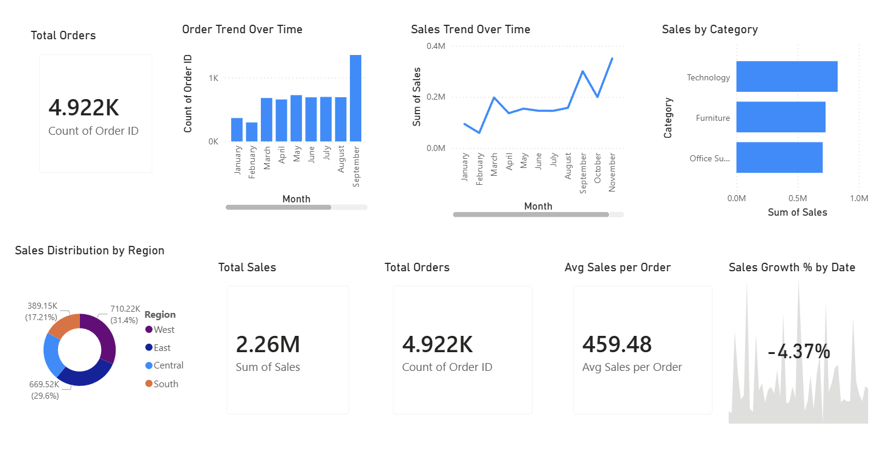

# 📊 Sales Forecasting Dashboard 

## 🔍 Project Overview

This project focuses on analyzing historical sales data and building an interactive **Sales Forecasting Dashboard** to help businesses understand sales trends, order patterns, and future performance.  
The dashboard enables data-driven decision-making through clear KPIs, time-based analysis, and forecasting visuals.

---

## 🎯 Business Objectives

- Analyze monthly sales and order trends  
- Identify seasonality and peak sales periods  
- Track key performance indicators (KPIs)  
- Forecast future sales to support planning and strategy  

---

## 🛠 Tools & Technologies

- **Power BI** – Data modeling, DAX, interactive dashboards  
- **Python (Pandas)** – Data cleaning and preprocessing  
- **Excel / CSV** – Raw data handling  
- **Kaggle Dataset** – Sample Superstore Sales Data  

---

## 📈 Key Features & Analysis

- Monthly sales trend analysis  
- Order volume analysis over time  
- KPI cards:
  - Total Sales  
  - Total Orders  
  - Average Sales per Order  
- Sales forecasting using time-series trends  
- Clean, interactive, and user-friendly dashboard design  

---

## 📄 Dashboard Pages

1. **Order Analysis**  
   - Order trends over time  
   - Sales distribution and KPIs  

2. **Sales Forecast**  
   - Historical sales trend  
   - Future sales forecasting for business planning  

---

## 🔑 Key Insights

- Sales show clear monthly and seasonal trends  
- Certain months consistently outperform others  
- Forecasting helps anticipate demand and optimize business strategy  

---

## 📂 Project Structure

Sales_Forecasting_Dashboard/
│
├── Data/
│   └── superstore_sales.csv
│
├── PowerBI/
│   └── sales_forecasting_dashboard.pbix
│
├── Images/
│   ├── order_analysis.png
│   └── sales_forecast.png
│
├── Notebook/
│   └── sales_forecasting_analysis.ipynb
│
└── README.md

---

## 📊 Dashboard Preview

---

## 📌 Dataset Source

**Sample Superstore Dataset** – Kaggle  

---

## 🚀 Conclusion

This project demonstrates practical skills in **data analysis, visualization, and forecasting**, making it suitable for **entry-level Data Analyst / Business Analyst roles**. It showcases the ability to convert raw data into meaningful business insights using industry-relevant tools.

---

## 👤 Author

**Sushree Sushrita Bhanja Deo**